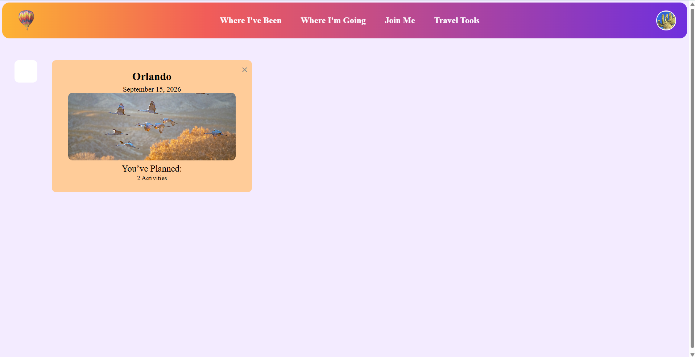

# Travel Management Site

A full-stack travel planning and tracking application built with React, TypeScript, Node.js, Express, and MongoDB.

Users can track places they have visited, plan future trips, manage travel tools, save packing lists and upcoming flights, and personalize their profile.

## Live Demo

[https://large-project-production.up.railway.app/](https://large-project-production.up.railway.app/)

## Screenshot



## Tech Stack

- React
- TypeScript
- Node.js
- Express
- MongoDB
- HTML/CSS
- Docker
- Railway

## Features

- User registration and login
- Session-based authentication
- Persistent user profiles and profile images
- Interactive “Where I’ve Been” country tracking
- Future trip planning and editing
- Trip activity planning
- Upcoming flight tracking
- Currency conversion tool
- Persistent packing lists
- User-scoped MongoDB data
- Responsive navigation and profile management
- Community/social feature prototype

## Project Background

This application was originally developed as a University of Central Florida team project.

During the original project, my contribution focused primarily on frontend development and API integration.

After the course project was completed, I independently revisited the application and modernized it for deployment and portfolio use.

## Independent Modernization Work

The portfolio version includes several improvements I completed after the original team project:

- Replaced hard-coded production URLs with same-origin API requests
- Added secure password hashing
- Added server-side session authentication
- Added authenticated user scoping to protected routes
- Configured Express for Railway’s HTTPS proxy
- Added environment-based MongoDB configuration
- Updated the application to use Railway’s dynamic `PORT`
- Configured Express to serve the production React build
- Added Docker deployment support
- Deployed the application and MongoDB database on Railway
- Fixed persistence for trips, flights, packing lists, visited countries, and profile images
- Added persistent profile image storage
- Added packing-list deletion and item management
- Fixed navigation behavior across authenticated pages
- Reworked the “Join Me” page as a clearly labeled prototype feature
- Removed obsolete deployment/webhook logic from the original project

## Architecture

```text
Browser
   |
   | React + TypeScript
   v
Express / Node.js API
   |
   | Session authentication
   | User-scoped CRUD operations
   v
MongoDB
```

The React frontend and Express backend are deployed together as one Dockerized application. Express serves the production frontend build and exposes the application API, while MongoDB stores user accounts, trips, travel data, packing lists, flights, visited countries, and profile information.

## Community Prototype

The **Join Me** page is intentionally presented as a prototype feature.

It demonstrates a possible future social component where travelers could share trip photos and experiences with other users. The displayed posts are sample content used to illustrate the intended concept rather than live user-generated posts.

## Local Development

### Requirements

- Node.js 20+
- npm
- MongoDB

### 1. Install backend dependencies

From the project root:

```bash
npm install
```

### 2. Install frontend dependencies

```bash
npm install --prefix frontend
```

### 3. Configure environment variables

Create a local `.env` file based on `.env.example`.

Example:

```text
MONGO_URI=mongodb://127.0.0.1:27017/travel-app
SESSION_SECRET=replace-with-a-long-random-secret
PORT=5000
```

Do not commit real credentials or secrets.

### 4. Build the frontend

```bash
npm run build --prefix frontend
```

### 5. Start the application

```bash
npm start
```

## Docker

Build the application image:

```bash
docker build -t travel-management-site .
```

Run the container with the required environment variables:

```bash
docker run --rm -p 5000:5000 \
  -e MONGO_URI="your-mongodb-connection-string" \
  -e SESSION_SECRET="your-session-secret" \
  -e PORT=5000 \
  travel-management-site
```

## Railway Deployment

The portfolio version is deployed on Railway using:

- A Dockerized Node.js/Express application service
- A managed MongoDB service with persistent storage
- Environment-variable based configuration
- Railway public HTTPS networking

The application service references the MongoDB connection through Railway environment variables.

## Security Improvements

The portfolio version improves the original academic implementation by using:

- Password hashing instead of plaintext passwords
- Server-side session authentication
- Secure production cookies
- Authenticated user-scoped routes
- Environment variables instead of hard-coded credentials
- Same-origin API requests
- Persistent MongoDB-backed user data

## Deployment Testing

The deployed application has been tested for:

- Registration
- Login/logout
- Profile image persistence
- Visited-country persistence
- Trip creation and editing
- Upcoming flight persistence
- Packing-list creation, editing, saving, and deletion
- Currency conversion
- Navigation between authenticated pages

## Attribution

This repository preserves attribution to the original project contributors.

My original contribution focused primarily on frontend development and API integration. The later security, persistence, deployment, authentication, Docker, MongoDB configuration, and production-hosting work was completed independently after the original team project.
